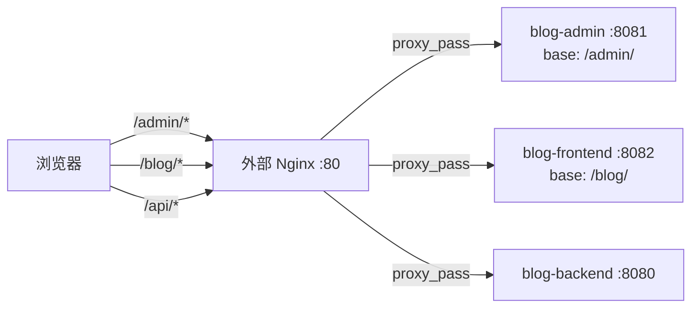

## 用户需求
用户已将 blog-admin（管理后台）和 blog-frontend（前台门户）通过 Docker 部署，容器分别暴露端口 8081 和 8082。现需要通过外部 Nginx（80 端口）统一反向代理访问这两个项目，需要知道 Nginx 如何配置。

## 核心功能
- 外部 Nginx 通过 `location /admin` 反向代理到 blog-admin 容器（8081 端口）
- 外部 Nginx 通过 `location /blog` 反向代理到 blog-frontend 容器（8082 端口）
- 外部 Nginx 统一代理 `/api/` 到 blog-backend 容器（8080 端口），处理两个前端的 API 调用
- 修改 blog-frontend 源码以支持 `/blog/` 子路径部署（Vite base、路由 history、Dockerfile、nginx.conf）
- 替换用户 Nginx 中现有的 `/blog` 静态文件 location 为 proxy_pass 方式

## 技术栈
- Nginx（外部反向代理）
- Vite（前端构建工具）
- Vue Router（前端路由）
- Docker + docker-compose（容器编排）

## 实现方案

### 整体架构

### 关键设计决策

**1. blog-frontend 子路径改造（方案 A：修改源码）**
- 在 `vite.config.js` 中设置 `base: '/blog/'`，确保打包后所有资源引用路径带 `/blog/` 前缀
- 路由改为 `createWebHistory('/blog/')`，使前端路由在 `/blog/` 上下文中工作
- Dockerfile 中将 `dist` 复制到 `/usr/share/nginx/html/blog`，与 base 路径对应
- 内部 nginx 添加 `/blog/` location，try_files 兜底到 `/blog/index.html`（SPA history 模式）

选择此方案的原因：blog-admin 已使用相同模式（`base: '/admin/'` + 子目录部署），保持一致性且稳定可靠。方案 B（sub_filter 动态替换）复杂度高、不稳定，不推荐。

**2. API 代理策略**
- 两个前端均使用 `axios.create({ baseURL: '/api' })`（绝对路径），API 调用不经过 base 路径
- 外部 Nginx 统一添加 `/api/` location，直接 proxy_pass 到 `http://127.0.0.1:8080`
- 避免请求经过容器内部 nginx 的二次代理，减少延迟

**3. blog-admin 无需修改**
- 已配置 `base: '/admin/'`、路由 `createWebHistory('/admin/')`、Dockerfile 子目录部署
- 外部 Nginx 直接 `location /admin { proxy_pass http://127.0.0.1:8081; }` 即可

### 实现注意事项

- **向后兼容**：blog-frontend 修改后，直接访问容器 8082 端口（原方式）将不可用，因为页面期望 URL 前缀 `/blog/`。这是预期行为，统一通过外部 Nginx 80 端口访问。
- **WebSocket**：博客系统当前无 WebSocket 需求，proxy_pass 默认配置即可。
- **日志**：沿用外部 Nginx 现有日志配置，不引入额外日志。
- **性能**：`/api/` 由外部 Nginx 直接代理到后端，减少一跳（不再经过前端容器 nginx 二次代理），略有性能提升。

