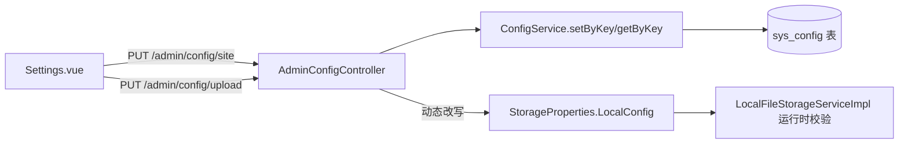

## 用户需求
修复博客后台系统设置页面保存配置时报 404 的问题，并补齐后端缺失的配置管理接口。

## 产品概述
后台管理端 `Settings.vue` 提供三个设置 Tab：网站配置、修改密码、文件上传。其中"修改密码"接口已存在且正常；而"网站配置"调用的 `PUT /api/admin/config/site` 与"文件上传"调用的 `PUT /api/admin/config/upload` 在后端均无对应接口，导致请求返回 404。需新增配置管理后端接口，保存数据并让上传配置在运行时动态生效。

## 核心功能
- 新增后端 `AdminConfigController`，提供 `PUT /admin/config/site` 接口，将网站名称、描述、域名持久化到 `sys_config` 表。
- 新增后端 `AdminConfigController`，提供 `PUT /admin/config/upload` 接口，将上传路径、允许类型、最大大小持久化，并动态改写运行时 `StorageProperties.LocalConfig`，使上传限制立即生效（无需重启）。
- 提供对应的 `GET /admin/config/site` 与 `GET /admin/config/upload` 查询接口，支持前端配置回显。
- 复用现有 `Config` 实体、`ConfigService`/`ConfigMapper` 完成数据库读写，新接口统一受 Spring Security `/admin/**` 鉴权保护。


## 技术栈
- 后端：Spring Boot + Spring Security + MyBatis-Plus（既有技术栈，不引入新框架）
- 前端：Vue 3 + Element Plus（既有，`Settings.vue` 无需改动，接口路径与字段已匹配）
- 持久化：MySQL `sys_config` 表（`configKey`/`configValue` 键值结构）

## 实现方案
### 策略
复用已存在的 `Config` 实体与 `ConfigService`，新增一个 `AdminConfigController` 暴露 `site`/`upload` 两类配置接口；在 Service 层封装基于 `configKey` 的 upsert（存在即更新、不存在即插入）。上传配置保存时，除了入库，还直接调用 `StorageProperties.LocalConfig` 的 setter 更新内存字段，借助 `LocalFileStorageServiceImpl` 持有同一 Bean 引用的特性，使大小/类型/路径校验立即生效。

### 关键技术决策
- **复用而非新建表**：`sys_config` 为通用键值表，site/upload 配置均以带前缀的 `configKey`（如 `site.blogName`、`upload.maxSize`）存储，符合现有表设计，避免新增表结构迁移。
- **动态生效范围收敛为 local 类型**：仅当 `storage.type=local` 时改写 `LocalConfig`；`urlPrefix` 前端未传，保持配置原值不变，避免误覆盖；`maxSize` 由前端 MB 转为字节再写入 Bean，与 `StorageProperties` 单位一致。
- **GET 回显接口补齐**：前端当前未调用查询接口，但补齐后可支撑刷新后数据回填，且为后续扩展预留，成本低。
- **鉴权零改动**：`SecurityConfig` 已对 `/admin/**` 要求认证，`/admin/config/**` 自动受保护，无需调整安全规则。

### 性能与可靠性
- 配置读写为单条 KV upsert，O(1) 数据库操作，无 N+1 风险；接口无循环、无重型计算。
- `setByKey` 使用 `saveOrUpdate` 或先查后插，避免唯一键冲突异常。
- 动态更新 `StorageProperties` 字段无并发锁，但配置保存为低频管理操作，可接受；如需更严谨可后续加 `@Transactional` 或同步块，本次不做过度设计。

## 实现要点
- 后端新增接口返回统一 `Result` 结构（沿用项目既有响应封装）。
- `uploadConfig.maxSize` 单位为 MB，后端转换为字节写入 Bean 与数据库。
- `allowedTypes` 以逗号分隔字符串存储，与 `StorageProperties.allowedTypes` 格式一致。
- 不改动既有 `StorageProperties`、`LocalFileStorageServiceImpl` 代码，仅通过 setter 注入值。

## 架构设计


## 目录结构
```
blog-backend/src/main/java/com/dlbyy/blog/
├── service/
│   ├── ConfigService.java              # [MODIFY] 新增 getByKey(String)、setByKey(String,String,String) 接口方法，封装基于 configKey 的读取与 upsert。
│   └── impl/
│       └── ConfigServiceImpl.java      # [MODIFY] 实现上述两个方法，使用 MyBatis-Plus 的 saveOrUpdate 或先查后写避免唯一键冲突。
├── controller/
│   └── admin/
│       └── AdminConfigController.java  # [NEW] @RequestMapping("/admin/config")。提供 PUT /site、PUT /upload 保存接口与 GET /site、GET /upload 查询接口；upload 保存时调用 StorageProperties.LocalConfig 的 setter 动态生效。
└── storage/
    └── StorageProperties.java          # [不改动] LocalConfig 字段有 Lombok @Data 生成的 setter，供 Controller 动态赋值，仅作依赖引用。
```

## 关键代码结构
```java
// ConfigService 扩展接口
public interface ConfigService extends IService<Config> {
    String getByKey(String configKey);
    void setByKey(String configKey, String configValue, String description);
}

// AdminConfigController 路由签名
@RestController
@RequestMapping("/admin/config")
public class AdminConfigController {
    @PutMapping("/site")   // 接收 Map<String,Object> 或 SiteConfigDTO
    @PutMapping("/upload") // 接收 UploadConfigDTO {uploadPath, allowedTypes, maxSize(MB)}
    @GetMapping("/site")
    @GetMapping("/upload")
}
```

