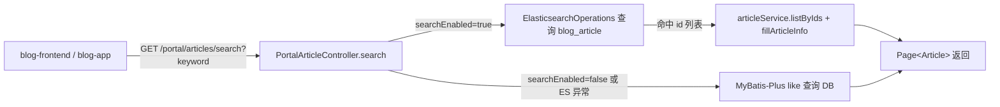

## 用户需求
让博客系统的搜索功能真正使用 Elasticsearch 全文检索：blog-app 与 blog-frontend 都通过 `/portal/articles/search` 接口进行文章搜索，且该接口后端基于 Elasticsearch 索引 `blog_article` 完成检索。

## 产品概述
当前 `/portal/articles/search` 接口仅使用数据库 `like` 模糊查询。Elasticsearch 的写入同步链路（文章发布/更新/删除 → 事件 → `ArticleEsSyncListener` → 写入 `blog_article` 索引）已就绪，但查询入口未接入。需改造后端搜索接口在 ES 启用时走 ES 检索，并让 web 前台在搜索时改用该接口。

## 核心功能
- 后端 `PortalArticleController.search()` 在 `blog.search.enabled=true` 时使用 Elasticsearch 对 title/summary/content 做 IK 中文分词检索，否则回退数据库查询。
- blog-frontend 搜索时调用 `/portal/articles/search`（新增前端 API 方法并在列表页切换）。
- blog-app 已调用该接口，无需改动调用，仅需后端 ES 化即满足要求。
- 保持响应结构 `Result<Page<Article>>`（含 `records`/`total`），兼容现有前端解析。


## 技术栈
- 后端：Spring Boot 3 + Spring Data Elasticsearch（已引入依赖）+ MyBatis-Plus（回退路径）
- 前端：Vue3 + axios（blog-frontend）；uni-app（blog-app，已就绪无需改动）
- 检索：Elasticsearch 8.11.1 + IK 分词（`blog_article` 索引，title/summary/content 使用 `ik_max_word`）

## 实现方案
采用"后端接口双路径 + 前端路由切换"策略：后端 `search()` 先判断 `blog.search.enabled` 开关与 ES 可用性，开启时通过 `ArticleRepository`/`ElasticsearchOperations` 在 `blog_article` 索引检索，命中 id 后反查 `Article` 装配；未开启时回退原有数据库 `like` 逻辑。前端仅 blog-frontend 需要新增 search API 并在有关键词时切换调用，blog-app 已满足。

### 关键技术决策
1. **ES 检索用 `NativeQuery` 的 multiMatchQuery**：对 title/summary/content 三个 `text` 字段做 `ik_smart` 分词匹配，比数据库 `like` 更精准且支持中文分词。命中后取文档 id 列表，用 `articleService.listByIds` 反查 `Article` 实体并 `fillArticleInfo`，保证返回字段与数据库路径完全一致（前端零改动字段）。
2. **开关与回退**：注入 `@Value("${blog.search.enabled:false}") boolean searchEnabled`；同时 `ArticleRepository` 用 `@Autowired(required=false)`。当 `searchEnabled=false` 或 Repository 为 null 时，走原数据库逻辑，确保未启用 ES 的部署（默认）不报错、不影响现有功能。
3. **分页与排序**：ES 侧用 `Pageable` 分页并获取 `totalHits`；排序沿用前端期望的 `createTime` 降序（或 ES 相关度，方案选择相关度优先、其次时间，保持简单用时间降序以减少差异）。构造 MyBatis-Plus `Page<Article>` 返回，与现有契约一致。
4. **异常处理**：ES 查询包裹 try-catch，连接失败/索引不存在时降级到数据库查询并打日志（与 `ArticleEsSyncListener` 的"失败不影响主流程"风格一致），避免单点故障导致搜索不可用。

## 实现说明（执行要点）
- 仅改造 `PortalArticleController.search()`，不新增独立 Service 层（保持与现有 controller 直接调用 service/repository 的轻量风格一致）。
- 返回类型严格保持 `Result<Page<Article>>`，`records` 为 `Article` 列表、`total` 为命中总数，兼容 blog-app `res.data.records`/`res.data.total`。
- 新增前端方法命名与 blog-app 对齐：`searchArticles`。
- 注意 blog-frontend `ArticleList.vue` 当前用 `getArticles(params)` 同时处理分类/标签/搜索；需仅在 `keyword` 存在分支改用 `searchArticles`，分类/标签仍走 `getArticles`。

## 架构设计
搜索请求流（ES 启用时）：


## 目录结构
```
blog-backend/src/main/java/com/dlbyy/blog/controller/portal/
└── PortalArticleController.java   # [MODIFY] 改造 search()：注入 ArticleRepository(required=false) 与 searchEnabled 开关；ES 启用时走 Elasticsearch 检索并反查 Article，否则回退 DB like；保持 Result<Page<Article>> 返回结构
blog-frontend/src/api/
└── article.js                     # [MODIFY] 新增 searchArticles(params) -> GET /portal/articles/search
blog-frontend/src/views/
└── ArticleList.vue                # [MODIFY] 当 route.query.keyword 存在时，改用 articleApi.searchArticles 调用 search 接口，其余渲染与分页逻辑不变
```

## 关键代码结构（可选）
后端注入与分支示意（仅接口级，非实现体）：
```java
@RestController
@RequestMapping("/portal/articles")
@RequiredArgsConstructor
public class PortalArticleController {
    private final ArticleService articleService;
    @Autowired(required = false) private ArticleRepository articleRepository;
    @Value("${blog.search.enabled:false}") private boolean searchEnabled;
    // search() 内：if (searchEnabled && articleRepository != null) { ES 检索 } else { DB like }
}
```

